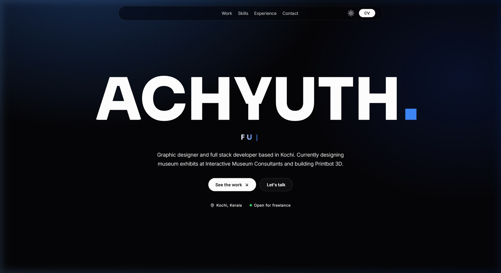
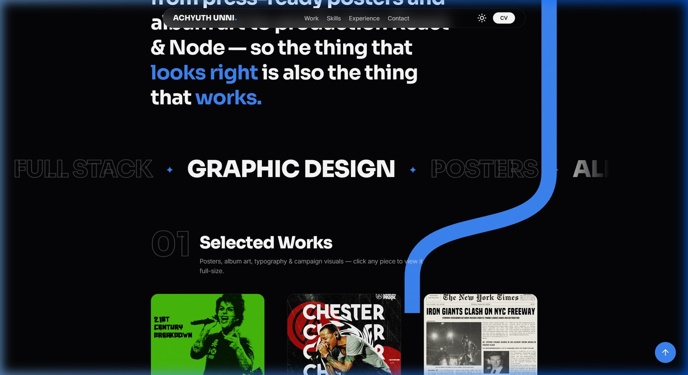
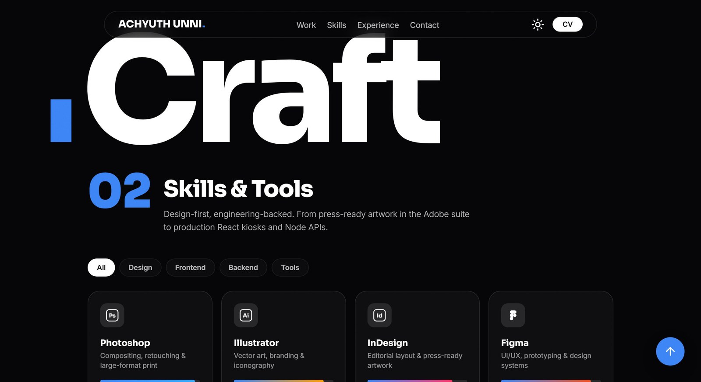
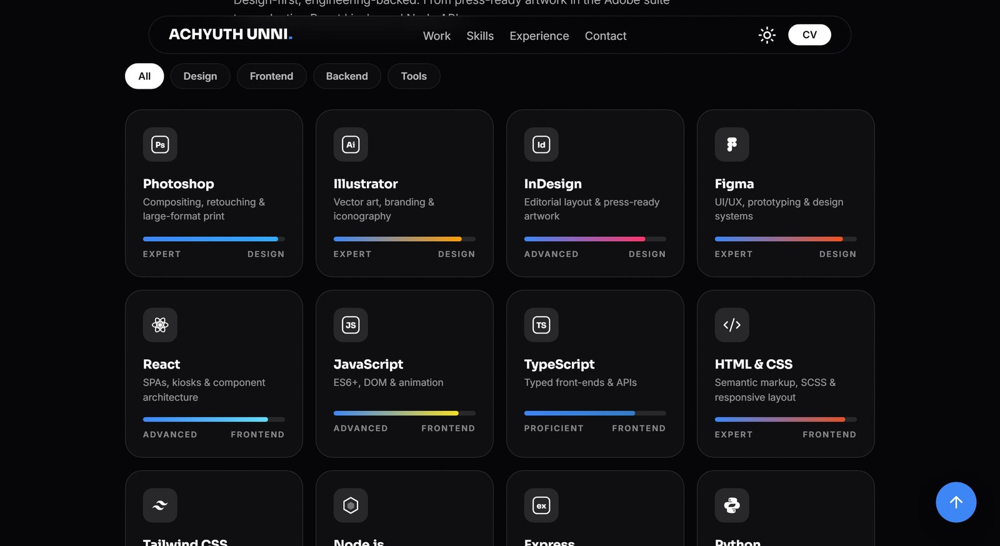
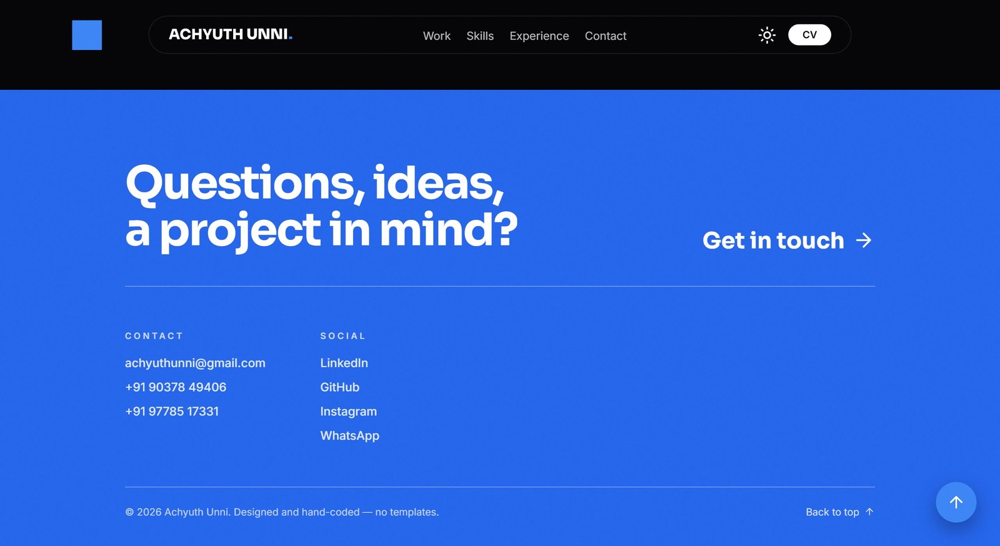

# Achyuth Unni — Graphic Designer & Full Stack Developer, Kochi

**Design gets the attention. Code keeps it.**
A hand-coded portfolio that treats the scroll itself as a design material — no framework, no bundler, just vanilla HTML, CSS and JavaScript.

[](https://achyuth-u.github.io/Personal-Portfolio/)


**[→ View the live site](https://achyuth-u.github.io/Personal-Portfolio/)**

---

<p align="center">
  
</p>

## What Makes It Different

### Self-Writing Wordmark

The name "ACHYUTH" writes itself on load — not a CSS trick on a web font, but **real Sora ExtraBold outlines** (`logo.js`) revealed through SVG stroke masks that trace each letter's skeleton. All seven letters animate at once, each one's strokes chaining smoothly. The outlines and writing paths are extracted offline from the actual `.ttf` with `fontTools` and `uharfbuzz` (see `tools/`).

### Wordmark → Nav Morph

As you scroll, the giant hero wordmark shrinks and glides into the floating navigation bar as "ACHYUTH UNNI." — a single DOM element interpolated between two measured positions with `translate3d` + `scale`, switching from the hero font size to the nav font size at dock. The blue dot rides alongside, repositioning from after the H to after UNNI.

### The Ribbon

<p align="center">
  
</p>

A square blue dot after the final H stretches into a scroll-scrubbed band the moment you scroll. With inertial smoothing (a `0.14`-factor chase on `scrollY`), the band:

1. **Drops** from the dot and unrolls the **featured window** — a masked image of one of six hero-worthy pieces, picked at random on every visit (`FEATURED_POOL` in `interactive.js`).
2. **S-curves** into the works section and takes a **randomised route** through the gaps between the masonry columns — a seeded walk that changes every visit (rounded 90° turns throughout). Append `?seed=123` to the URL to pin a specific route.
3. **Lands** on a square dot just before the giant "Craft" title, then **reels itself in** as you keep scrolling — the hero dot in reverse — until only the dot remains.
4. **Carries on** from that dot straight down the margin: it grows out of the dot, pauses as a dot beside each section number (03, 04, 05) and finally comes to rest as a dot just above the footer.

Everything reverses on the way back up. On phones the ribbon hugs the right edge — dead straight from the hero dot through the featured window — and only bends where it crosses between the posters, ending in the left margin; on tablets it zig-zags between the columns and the page margins. The section block is nudged inward just enough to give the line a lane.

**How it works:** An SVG `<path>` is computed at runtime from the actual masonry geometry. `stroke-dasharray` + `stroke-dashoffset` are driven by an effort-mapped, smoothed scroll value — vertical travel counts in full, horizontal zips at 7 %. The reel-in phase sweeps a second dash window from the hero end toward the dot.

<p align="center">
  
</p>

### Featured Window

The ribbon's masked media panel — one of six showcase pieces chosen at random on every visit from `FEATURED_POOL`. The window unrolls from the top via `clip-path: inset(...)` as the ribbon head reaches it. Click to open in the lightbox.

### Randomised Works Route

The ribbon's path through the 12-piece masonry grid is computed by a seeded PRNG (`RIB_SEED`) that walks downward through the inter-tile corridors, picking at random between the nearest few crossings. In the lower half it steers back toward the left margin so it finishes cleanly at the dot. A new seed every visit; `?seed=N` pins one.

### Pinned, Folding Rows

<p align="center">
  
</p>

Experience, Code & Builds, and Credentials are numbered rows where every row starts open, a title pins under the nav (`position: sticky`), and its description folds away beneath it as you scroll — a scroll-scrubbed `clip-path` with a fade. Nothing toggles, nothing can be skipped.

### Skills Grid

16 skill cards with hand-drawn brand icons (SVG), animated percentage bars, hover spotlight (`--mx`/`--my` pointer tracking), icons that tip a different way on every hover, count-up numbers, and chip-based filtering (All / Design / Frontend / Backend / Tools) with FLIP-animated reflows. A marquee of 23 additional tools scrolls below.

### Footer Character Reveal

<p align="center">
  
</p>

The full-bleed blue footer — "Questions, ideas, a project in mind? Get in touch →" — is revealed line by line, character by character from behind a clip mask as it enters the viewport. Each character gets its own `<span>` with staggered `--c` and `--l` indices.

### Atmosphere & Polish

| Feature | Implementation |
|---|---|
| **Grainy gradient** | One `radial-gradient` behind the hero + animated SVG `feTurbulence` film grain (`mix-blend-mode: overlay`) |
| **Dark / light theme** | CSS custom properties toggled on `body.light` — one palette per mode, top to bottom |
| **Custom cursor** | Pointer-following dot with inertial chase; expands to a "VIEW" label over works and the featured window |
| **Lightbox** | Captions, counter, keyboard nav (← → Esc), swipe on touch screens, swap animation |
| **Typing effect** | Cycles through "Graphic Designer", "Full Stack Developer", "Visual Storyteller" |
| **Mobile menu** | Hamburger in the nav capsule (≤768px) opens a full-screen menu — numbered links stagger in, CV + email below; closes on link tap, Esc or resize |
| **Reduced motion** | Respects `prefers-reduced-motion` — letters appear instantly, marquees and reveals switch off |
| **Statement fill** | The intro paragraph lights up word by word as you scroll through it |

---

## Tech & How It Works

**Vanilla HTML, CSS and JavaScript.** No React, no Svelte, no bundler, no build step. The site is three files — `index.html`, `styles.css`, `interactive.js` — plus `logo.js` (generated offline).

| Layer | What |
|---|---|
| **Typography** | [Sora 800](https://fonts.google.com/specimen/Sora) (headings & wordmark), [Inter 300–600](https://fonts.google.com/specimen/Inter) (body) via Google Fonts |
| **Icons** | Nine inline SVG icons (Lucide shapes) rendered by a 20-line helper — no icon library, no third-party script; skill icons are hand-drawn SVG in `interactive.js` |
| **Layout** | CSS Grid & Flexbox, CSS custom properties for theming, `position: sticky` for the nav and row titles |
| **Animation** | `requestAnimationFrame` loops, `IntersectionObserver` reveals, CSS `@keyframes` for grain and marquee |
| **Scroll engine** | One rAF-throttled `scroll` listener feeds registered callbacks; a parallel inertial copy (`sY`) chases `scrollY` at factor `0.14` for the ribbon and the wordmark morph |

### The ribbon in one paragraph

An SVG `<path>` string is built at runtime by measuring the masonry grid's column widths, gaps, and tile positions, then walking a seeded random route through the inter-tile corridors with rounded 90° turns. `stroke-dasharray` is set to `"<visible-length> 100000"` and `stroke-dashoffset` to the negative of the start position, so only the drawn segment is visible. An effort profile maps each point along the path to an "effort" value (vertical pixels count 1:1, horizontal only 0.07) so the head moves at a perceptually even pace regardless of direction. The head position is driven by the inertially-smoothed `sY` and doubles its pace over the final drop so the band lands as "Craft" enters view. A second pass sweeps a reel-in window from the hero end forward, gathering the band into the dot.

---

## Project Structure

```text
.
├── index.html            # Core structure (all sections, nav, lightbox, ribbon SVG shell)
├── styles.css            # Design system — CSS variables at the top, dark/light themes, layout, animations
├── interactive.js         # Works & skills data, morph, ribbon, rows, cursor, lightbox, typing effect
├── logo.js               # Generated: 'ACHYUTH' outlines + writing stroke masks, SVG builder
├── images/
│   ├── works/            # 12 WebP images (full size) + works/sm/ 800px variants for phones and tablets
│   └── readme/           # Screenshots for this README
├── files/
│   └── Resume_Achyuth.pdf
├── tools/                # Offline helpers (NOT loaded by the site)
│   ├── Sora.ttf          # Source font (variable)
│   ├── glyphs.py         # Sora.ttf → logo-data.json: letter outlines + writing skeletons
│   ├── build_logo.py     # logo-data.json → the LOGO object in logo.js
│   ├── logo-data.json    # Intermediate glyph data
│   ├── shot.py           # Headless-Chrome screenshots at given scroll offsets
│   └── probe.py          # Headless-Chrome ribbon-state probe at given scroll offsets
├── LICENSE               # MIT
└── README.md
```

---

## Run Locally

```bash
# Any static server works — the site has no build step
python -m http.server 5173
# → http://localhost:5173

# Or just open index.html directly in a browser
```

---

## tools/

The `tools/` directory contains offline helpers that are **not loaded by the live site**.

| Script | Purpose | Dependencies |
|---|---|---|
| `glyphs.py` | Extracts "ACHYUTH" outlines from `Sora.ttf` (variable font, instanced at weight 800) and derives per-letter writing skeletons. Outputs `logo-data.json`. | `fontTools`, `uharfbuzz` |
| `build_logo.py` | Converts `logo-data.json` into the `const LOGO = {...}` object inside `logo.js`. Preserves ink-trap fix polygons for A and Y from the existing file. | (stdlib only) |
| `shot.py` | Takes headless-Chrome screenshots at specified scroll offsets via Chrome DevTools Protocol. | `websocket-client` |
| `probe.py` | Prints the ribbon's dash state (drawn / reeled-in lengths) at given scroll offsets, headless. | `websocket-client` |

To regenerate the wordmark after changing the name or font:

```bash
cd tools
python glyphs.py          # → logo-data.json
python build_logo.py      # → ../logo.js updated
```

---

## Customising

### Works

Edit the `WORKS` array at the top of `interactive.js`. Each entry is `{ src, title, cat, tools, ratio }` — the image loads from `images/works/<src>.webp`. Add or remove entries freely; the masonry, ribbon route, and lightbox adapt automatically.

### Featured Pool

`FEATURED_POOL` (also in `interactive.js`) lists the `src` keys eligible for the hero featured window. One is picked at random on each visit.

### Skills

`SKILLS` and `MORE_TOOLS` arrays in `interactive.js`. Each skill has `{ name, cat, pct, brand, meta, icon }`. Categories must be one of `design | frontend | backend | tools` to match the filter chips.

### Rows (Experience / Code & Builds / Credentials)

Edit the `<article class="row">` blocks directly in `index.html` (sections 03–05). The sticky-fold behaviour applies automatically to every `.row` block.

### Colours & Theme

CSS custom properties at the top of `styles.css`:

```css
:root {
    --bg: #050507;
    --text: #ffffff;
    --accent: #3b82f6;
    --accent-deep: #2563eb;   /* footer */
    /* ... */
}
body.light {
    --bg: #f5f5f7;
    --text: #121212;
    --accent: #2563eb;
    /* ... */
}
```

---

## Credits

Fonts by Google Fonts ([Sora](https://fonts.google.com/specimen/Sora), [Inter](https://fonts.google.com/specimen/Inter)). Icon shapes from [Lucide](https://lucide.dev/), inlined.

---

## License

[MIT](LICENSE) © 2026 Achyuth Unni

---

## Contact

| | |
|---|---|
| **Email** | [achyuthunni@gmail.com](mailto:achyuthunni@gmail.com) |
| **LinkedIn** | [linkedin.com/in/achyuth-unni](https://www.linkedin.com/in/achyuth-unni/) |
| **GitHub** | [github.com/achyuth-u](https://github.com/achyuth-u/) |
| **Instagram** | [@ach_yuth._](https://www.instagram.com/ach_yuth._/) |
| **WhatsApp** | [wa.link/47oyi5](https://wa.link/47oyi5) |
